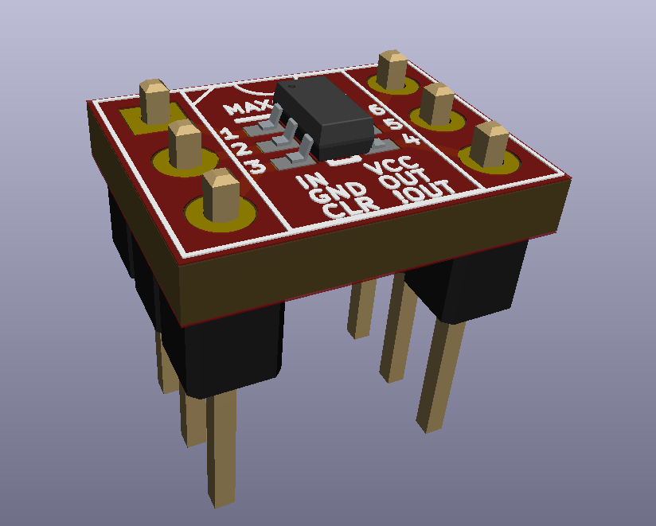

# MAX16054 Breadboard Breakout
A DIP6 size breakout for connecting the Maxim Integrated MAX16054 to a breadboard.

## Info
The Maxim Integrated MAX16054 is very useful for using a momentary switch to control power to your electronics projects. I designed this DIP6 size breakout board to easily connect it to a breadboard. I recommend browsing through the datasheet for the IC, as it shows many useful circuit examples. 

## Assembly
Solder the MAX16054 first, then solder two 1x03 2.54mm pitch pin headers. Look at the 3D render as a guide. It helps to stick the pin headers in a breadboard first, then place the PCB onto it before soldering. This way, it will align perfectly.

## Other
Open hardware design, feel free to do what you want with it.
